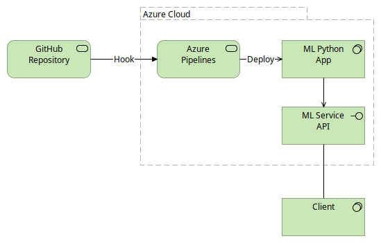
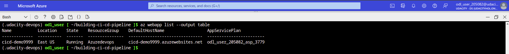
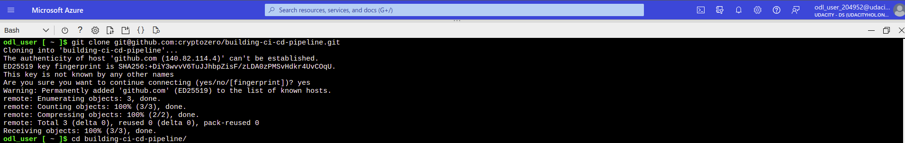
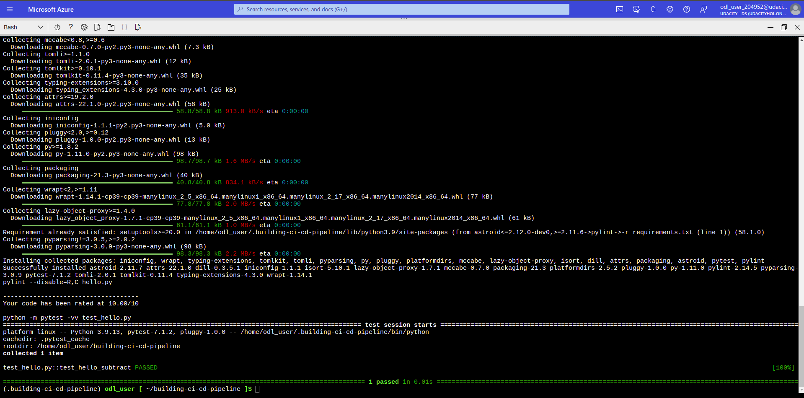
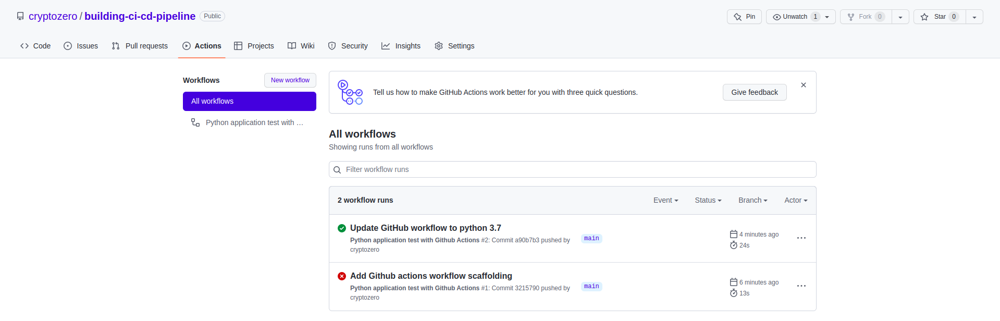
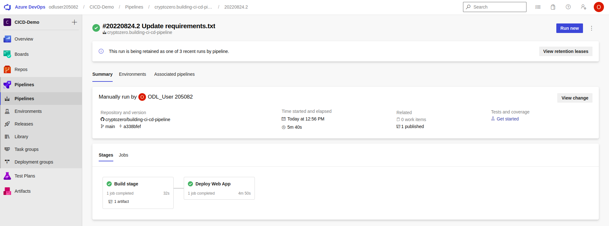
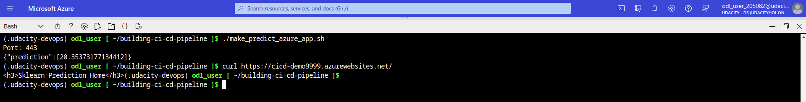
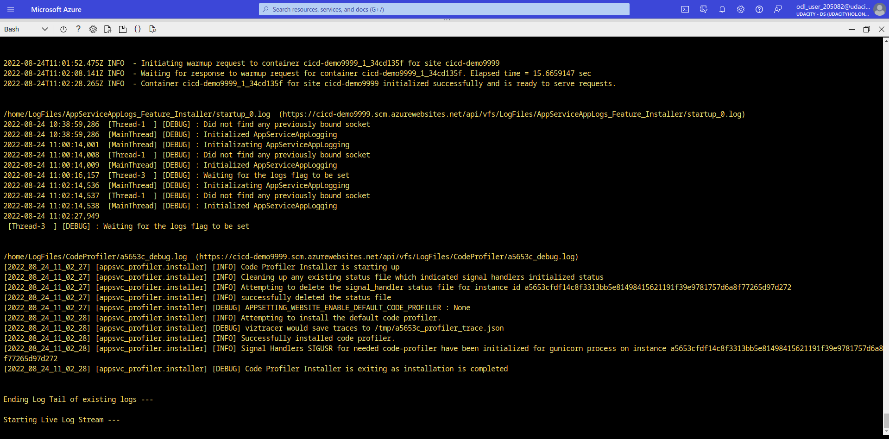

# Overview

This project is a demo of ML model python app deployment using an automated pipeline configured on Azure DevOps service.

## Project Plan

* A link to a Trello board for the project: https://trello.com/b/CEbwyiDb/udacity-project-planning
* A link to a spreadsheet that includes the original and final project plan: https://docs.google.com/spreadsheets/d/1AuPltyyS7-6IBS7Cs9E4hH8Zsn5nDy4wn58Sr9XnUc0/edit?usp=sharing

## Instructions

* Architectural Diagram (Shows how key parts of the system work)

Use commands.sh to run the app and load tests with example parameters.

* Project running on Azure App Service

* Project cloned into Azure Cloud Shell

* Passing tests that are displayed after running the `make all` command from the `Makefile`

* Output of a test run

* Successful deploy of the project in Azure Pipelines.

* Running Azure App Service from Azure Pipelines automatic deployment and Successful prediction from deployed flask app in Azure Cloud Shell.

* Output of streamed log files from deployed application

Optionally use locust to load test.

## Enhancements

- Python version and pip modules need custom environments and setup to deploy correctly on current cloud environments. An update of application code, model and dependencies could improve DevOps experience.
- Variability of Lab environments or standard account create several manual steps that could be automated on a standard deployment.
- Integrate load testing to build workflow.

## Demo 

Link Screencast on YouTube: [CI CD Deployment Demo Video](https://youtu.be/0Zp3hyNUsBg)
